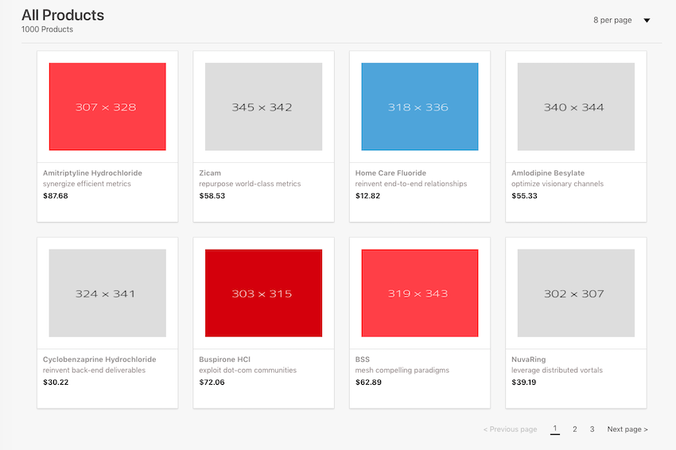

# Fullstack-Products

> A simple product listing app using React/Redux utilising Node.JS as backend API. (Monolith approach)

## Running the App

This should automatically run both the `server` and the `client`. I took advantage of [concurrently](https://www.npmjs.com/package/concurrently) module for running multiple commands at the same time.

```bash
yarn
yarn start
```
## Run Test

```bash
yarn test
```

## Folder Structure

### Frontend

`src` - This project is bootstraped using [create-react-app 2.0](https://facebook.github.io/create-react-app/). All the source code of the client can be found here. 

#### Features

* Redux for managing application state
* React Router 4 - Used for navigating page numbers and container routes
* Good components structure - Utilising components / containers approach
* Responsive
* Code Best Practices
* Test Coverage using Jest
* ES6+

#### Bonus

* Used Redux-Saga for keeping all the API calls in one place. It is a good alternative for side effects model for Redux.
* Configured [Redux Dev Tools](https://github.com/zalmoxisus/redux-devtools-extension) for viewing actions and states.
* Used [Plop](https://www.npmjs.com/package/plop) for generating uniform components and containers. Just type `yarn run generate`.
* Reusable components

### Server

This folder contains the Node.JS backend API. Implemented [express](https://expressjs.com/) as primary framework for creating the Rest endpoints.

`[GET] api/products` - Returns a list of products and supports the following parameters: 
`page` and `limit`.

Sample usage:

```
[GET] /api/products?page=2&limit=8

response:

{
    page: 2,
    limit: 2,
    pageCount: 500,
    total: 1000,
    data: [
        {
            id: 3,
            price: "$12.82",
            product_name: "Home Care Fluoride",
            description: "reinvent end-to-end relationships",
            product_image: "http://dummyimage.com/318x336.png/5fa2dd/ffffff"
        },
        {
            id: 4,
            price: "$55.33",
            product_name: "Amlodipine Besylate",
            description: "optimize visionary channels",
            product_image: "http://dummyimage.com/340x344.png/dddddd/000000"
        }
    ]
}


```

#### Features

* RESTful endpoints
* Test Coverage
* Express
* ES6+ Babel Setup
* Configurable Server

## Preview



## Author

#### [Richard](https://www.chardmd.com/) 😃

## License

Code released under the MIT License


